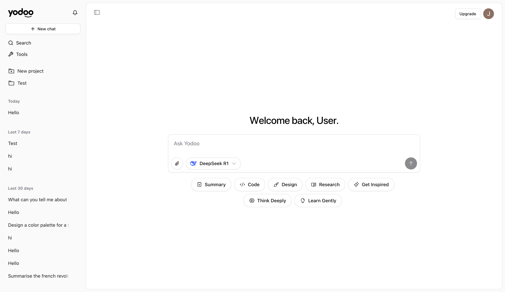

# Yodoo

[yodoo.ai](https://yodoo.ai)

**Yodoo** is the ultimate multi-model AI chat platform that brings together the best AI models, powerful tools, and a collaborative canvas - all in one seamless interface.

## What is Yodoo?

Yodoo is designed for professionals, creators, and teams who want to harness the power of multiple AI models without the hassle of switching between different platforms. Whether you're comparing model responses, using specialized AI tools, or collaborating on a canvas, Yodoo streamlines your AI workflow.

## Key Features

### 🤖 **Multi-Model Chat**

- **Compare AI models side-by-side**: Get responses from GPT-4, Claude, Gemini, Mistral, and more simultaneously
- **Smart model selection**: Choose the right model for each task - coding, writing, analysis, or creative work
- **Unified conversation history**: All your chats in one place, regardless of which models you used

### 🛠️ **Integrated AI Tools**

- **Built-in productivity tools**: Summarization, code generation, design assistance, research tools
- **Specialized workflows**: From data analysis to creative writing, access purpose-built AI tools
- **Seamless integration**: Tools work directly within your chat interface - no context switching

### 🎨 **Collaborative Canvas** _(Coming Soon)_

- **Visual collaboration**: Work with AI models on a shared canvas
- **Multi-modal interactions**: Combine text, images, and structured data
- **Team collaboration**: Share and collaborate on AI-powered projects

### 💼 **Professional Features**

- **Usage analytics**: Track your AI usage and optimize your workflow
- **Team management**: Collaborate with colleagues and manage access
- **Custom integrations**: API access for enterprise workflows
- **Priority support**: Get help when you need it most

## Why Choose Yodoo?

**Save Time**: Instead of juggling multiple AI platforms, get everything in one place
**Make Better Decisions**: Compare model outputs to choose the best response
**Boost Productivity**: Access specialized tools without leaving your chat
**Stay Organized**: Unified history and project management
**Scale Confidently**: From individual use to enterprise teams

## Getting Started

1. **Sign up** at [yodoo.ai](https://yodoo.ai)
2. **Choose your plan**: Free tier to get started, Pro for power users, Unlimited for teams
3. **Start chatting**: Select multiple models and see responses side-by-side
4. **Explore tools**: Try our built-in productivity and creative tools
5. **Invite your team**: Collaborate and share insights

## Plans & Pricing

### Free

- 100 messages per month
- Access to basic models
- Core productivity tools
- Perfect for trying Yodoo

### Pro ($20/month)

- 5,000 messages per month
- Access to all AI models
- Advanced tools and features
- Priority support
- 10,000 messages with your own API keys

### Unlimited ($100/month)

- Unlimited messages
- All premium features
- Team collaboration tools
- Custom integrations
- Dedicated support

## For Developers

Yodoo is built with modern technologies and offers:

- **REST API**: Integrate Yodoo into your applications
- **Webhooks**: Real-time notifications for team workflows
- **Custom tools**: Build and deploy your own AI tools
- **Enterprise SSO**: Secure authentication for large teams

See our [Developer Guide](./docs/DEVELOPER_GUIDE.md) for technical documentation.

## Built With

- [Next.js 15](https://nextjs.org/) — React framework
- [Vercel AI SDK](https://sdk.vercel.ai/) — AI model integration
- [Supabase](https://supabase.com/) — Database and authentication
- [Tailwind CSS](https://tailwindcss.com/) — Styling
- [Radix UI](https://www.radix-ui.com/) — Component primitives

## Security & Privacy

- **SOC 2 compliant** infrastructure
- **End-to-end encryption** for sensitive data
- **GDPR compliant** data handling
- **Bring your own keys** (BYOK) support
- **Enterprise-grade** security controls

## Support

- **Help Center**: [help.yodoo.ai](https://help.yodoo.ai)
- **Community**: Join our Discord community
- **Enterprise**: Contact sales@yodoo.ai for custom solutions

---

**Ready to supercharge your AI workflow?**  
[Get started with Yodoo →](https://yodoo.ai)

## License

Proprietary software. All rights reserved.
